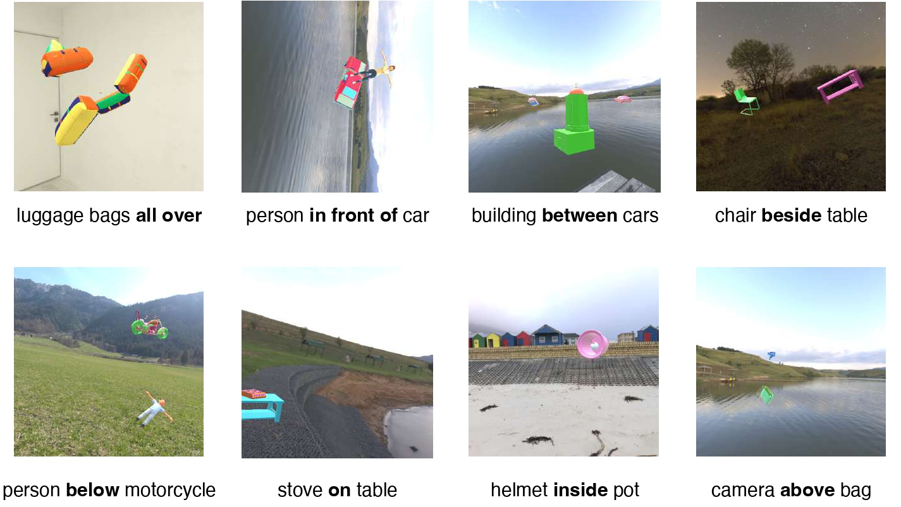
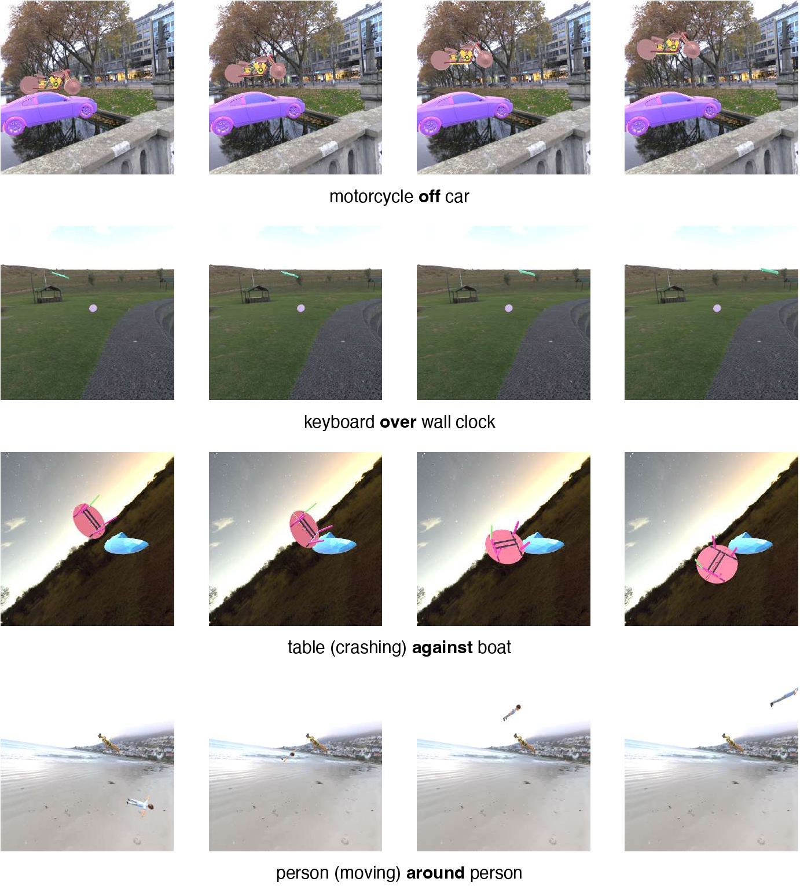

# STUPD Dataset


[](https://arxiv.org/abs/2309.06680v1)

STUPD (Spatial and Temporal Understanding of Prepositions Dataset) is a synthetic dataset that aims to help vision-language models understand relations at a granular level. STUPD covers 30 distinct spatial relations, and 10 distinct temporal relations. 

### Some examples from Spatial-STUPD






## How to access the dataset?
Currently, the STUPD dataset is not publically accessible (awaiting reviews). But you can view 50 examples from each category in [this google drive link](https://drive.google.com/drive/folders/178Gctqf-6kExJ6nfjdZGT_W_uW99vNEz?usp=sharing). 

The entire dataset will be available soon. 


## Generating the dataset
If you are interested in generating the dataset yourself, rather than using the dataset we provide, we provide all the UNITY configuration scripts for anyone to generate the (spatial)-STUPD dataset. There are many reasons why you would want to generate the dataset on your local UNITY setup. You can customize the logic, add in more configurations possibilities (more skins, backgrounds and objects), and also extract different types of meta-data.


## Bibtex
If you find our dataset useful in your research, please use the following citation:

```
@article{agrawal2023stupd,
  title={STUPD: A Synthetic Dataset for Spatial and Temporal Relation Reasoning},
  author={Agrawal, Palaash and Azaman, Haidi and Tan, Cheston},
  journal={arXiv preprint arXiv:2309.06680},
  year={2023}
}
```